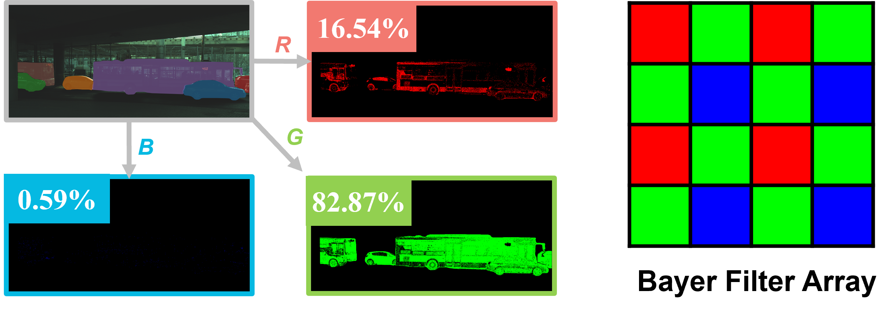

<h2 align="center">
  SimROD: A Simple Baseline for Raw Object Detection with Global and Local Enhancements
</h2>

<p align="center">
    <a href="https://github.com/ShihuaHuang95/DEIM/blob/master/LICENSE">
        
    </a>
    <a href="https://arxiv.org/abs/2503.07101">
        
    </a>
   <!-- <a href="https://www.shihuahuang.cn/DEIM/">
        
    </a> -->
    <!-- <a href="https://github.com/ocean146/simrod/pulls">
        
    </a>
    <a href="https://github.com/ShihuaHuang95/DEIM/issues">
        
    </a> -->
    <!-- <a href="https://github.com/ShihuaHuang95/DEIM">
        
    </a> -->
    <a href="mailto:whuocean@whu.edu.cn">
        
    </a>
</p>
<p align="center">
    SimROD is a lightweight and effective approach for RAW object detection. By introducing a Global Gamma Enhancement (GGE) module and leveraging the green channel's richer signal to enhance local details, the SimROD outperforms state-of-the-art methods while remaining efficient.
</p>

<div align="center">
  <a href="https://ocean146.github.io/">Haiyang Xie</a><sup>1,2</sup>,
  <a href="https://xishen0220.github.io">Xi Shen</a><sup>2</sup>
  <a href="http://www.shihuahuang.cn">Shihua Huang</a><sup>2</sup>,
  Qirui Wang<sup>1,2</sup>,
  <a href="https://wangzwhu.github.io/home/">Zheng Wang</a><sup>1</sup>
</div>

<p align="center">
<i>
1. Wuhan University &nbsp; 2. Intellindust AI Lab
</i>
</p>
<p align="center">
<strong>If you like our work, please give us a ⭐!</strong>
</p>

<p align="center">
  <!-- <figure style="display:inline-block; text-align:center;"> -->
    
    Green channels of RAW contain more informative signals
</p>

## 🚀 Updates
- [x] **\[2025.03.18\]** The code is released.
- [x] **\[2025.03.10\]** The paper is available on ArXiv.

## Table of Content
* [1. Requirements](https://github.com/ocean146/simrod?tab=readme-ov-file#1-requirements)
* [2. Data Preparation](https://github.com/ocean146/simrod?tab=readme-ov-file#2-data-preparation)
* [3. Evaluation](https://github.com/ocean146/simrod?tab=readme-ov-file#3-evaluation)
* [4. Model Performance](https://github.com/ocean146/simrod?tab=readme-ov-file#4-model-performance)
* [5. Training](https://github.com/ocean146/simrod?tab=readme-ov-file#5-training)
* [6. Acknowledgement](https://github.com/ocean146/simrod?tab=readme-ov-file#6-acknowledgement)
* [7. Citation](https://github.com/ocean146/simrod?tab=readme-ov-file#7-citation)


## 1. Requirements
Just execute the command below:
```bash
pip install -r requirements.txt
```

## 2. Data Preparation
### ROD

> During this project, we could only obtain the images and labels of the publicly available training set. Therefore, we randomly divided the acquired dataset, with 80% allocated for training and 20% for testing. The ROD dataset mentioned in this work refers to the version that we randomly divided. 

1. Download `00Train-raws.zip` from [here](https://openi.pcl.ac.cn/innovation_contest/innov202305091731448/datasets?lang=en-US) and arrange the images files in the following format:
```
SimROD_vs_DIAP
|-- data
    |-- ROD
        |-- raws
            |-- 00Train
                |-- name1.raw
                |-- name2.raw
                |-- ...
```
2. Preprocess the RAW images as follows:
```bash
python scripts/preprocess_raw.py -p data/ROD/raws/00Train
```
3. Download the annotation files from [BaiduNetDisk(code:2025)](https://pan.baidu.com/s/1ytnI99dlO3_9--Oh_RazIQ) or [GoogleDrive](https://drive.google.com/drive/folders/16PFJlnKAPrqrYwBluT-iDOP3lMtxphVq?usp=sharing) and move the files to `data/ROD/annotations/`.

### LOD and PASCALRAW
To align with current public available work, we use the version of LOD and PASCALRAW from [RAW-Adapter](https://github.com/cuiziteng/ECCV_RAW_Adapter). The download link and preprocess code can be obtained from [RAW-Adapter](https://github.com/cuiziteng/ECCV_RAW_Adapter). We provide the COCO-format annotation files of LOD and PASCALRAW, which can be downloaded in here. 

The dataset are supposed to be organized as follows:
```
SimROD_yolox
|-- data
    |-- LOD_BMVC2021
        |-- annotations
            |-- lod_dark_train_png.json
            |-- lod_dark_val_png.json
        |-- RAW_dark
            |-- 2.png
            |-- 4.png
            ...
    |-- PASCALRAW
        |-- annotations
            |-- pascalraw_train_coco.json
            |-- pascalraw_val_coco.json
        |-- origin
            |-demosaic
                |-- 2014_000001.png
                |-- 2014_000002.png
                ...
```

## 3. Evaluation
1. Modified the dataset path in config files. For example, when testing SimROD on LOD dataset, modified the `L44-L50` of config file `SimROD_vs_DIAP/workdirs/LOD/cfg_SimROD.py`

2. Download all the weights from [BaiduNetDisk(code:2025)](https://pan.baidu.com/s/17zEp6-Zz49M7q1O6e5cUfw) or [GoogleDrive](https://drive.google.com/file/d/1zoT8VOwrtebnmDEtXfdQQeRvkVNoXOIx/view?usp=sharing) to `SimROD_vs_DIAP/weights`
3. Execute the command below:
```bash
CUDA_VISIBLE_DEVICES=0 python eval.py \
    -f SimROD_vs_DIAP/workdirs/LOD/cfg_SimROD.py \
    -b 8 \
    -c SimROD_vs_DIAP/weights/simrod_lod_ap50_46.3.pth
```

## 4. Model Performance
|             | ROD  | LOD  | PASCALRAW | Add. Params(M) |
|-------------|------|------|-----------|----------------|
| [DIAP](https://github.com/XrKang/RAOD/tree/master/RAOD)        | 53.4 | 43.4 | 94.2      | 0.260          |
| Ours SimROD | 57.6 | 46.3 | 95.1      | 0.003          |


## 5. Training
1. Modified the dataset path in config files. For example, when training SimROD on LOD dataset, modified the `L44-L50` of config file `SimROD_vs_DIAP/workdirs/LOD/cfg_SimROD.py`

2. Download all the weights from here to `SimROD_vs_DIAP/weights`

3. Execute the command below:
```bash
CUDA_VISIBLE_DEVICES=0,1,2 python main.py \
    -f ./workdirs/LOD/cfg_SimROD.py \
    -d 3 \
    -b 12
```
## 6. Acknowledgement
This project builds upon the [DIAP](https://github.com/XrKang/RAOD/tree/master/RAOD) and [YOLOX](https://github.com/Megvii-BaseDetection/YOLOX). We are deeply grateful for their work and contributions. 

## 7. Citation

If you use `SimROD` or its methods in your work, please cite the following BibTeX entries:
<details open>
<summary> bibtex </summary>

```latex
@misc{xie2025simr,
      title={SimROD: A Simple Baseline for Raw Object Detection with Global and Local Enhancements},
      author={Haiyang Xie, Xi Shen , Shihua Huang, Qirui Wang and Zheng Wang},
      archivePrefix={arXiv},
      year={2025},
}
```
</details>